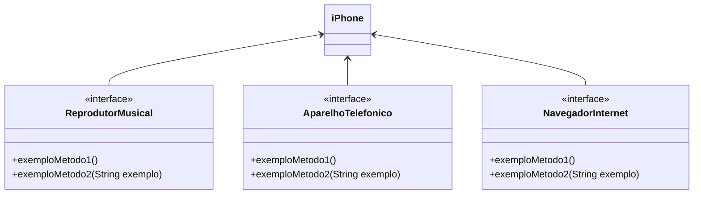

### Diagrama UML (Mermaid)

```mermaid
classDiagram
    class ReprodutorMusical {
        <<interface>>
        +exemploMetodo1()
        +exemploMetodo2(String exemplo)
    }

    class AparelhoTelefonico {
        <<interface>>
        +exemploMetodo1()
        +exemploMetodo2(String exemplo)
    }

    class NavegadorInternet {
        <<interface>>
        +exemploMetodo1()
        +exemploMetodo2(String exemplo)
    }

    class iPhone {
    }

    iPhone <-- ReprodutorMusical
    iPhone <-- AparelhoTelefonico
    iPhone <-- NavegadorInternet
```
