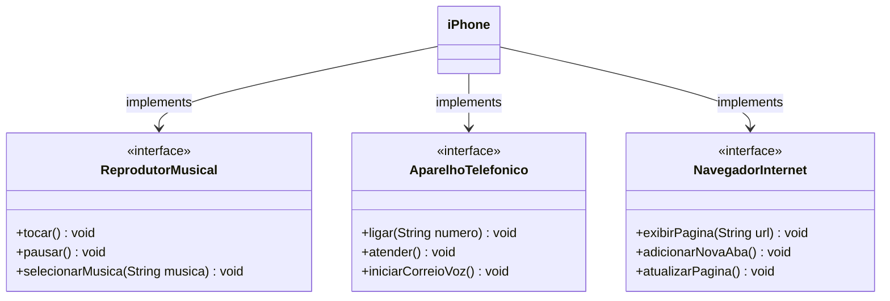

### iPhone Diagrama UML (Mermaid)

```mermaid
classDiagram
    class ReprodutorMusical {
        <<interface>>
        +tocar() void
        +pausar() void
        +selecionarMusica(String musica) void
    }

    class AparelhoTelefonico {
        <<interface>>
        +ligar(String numero) void
        +atender() void
        +iniciarCorreioVoz() void
    }

    class NavegadorInternet {
        <<interface>>
        +exibirPagina(String url) void
        +adicionarNovaAba() void
        +atualizarPagina() void
    }

    class iPhone {
    }

    iPhone --> ReprodutorMusical : implements
    iPhone --> AparelhoTelefonico : implements
    iPhone --> NavegadorInternet : implements
```
